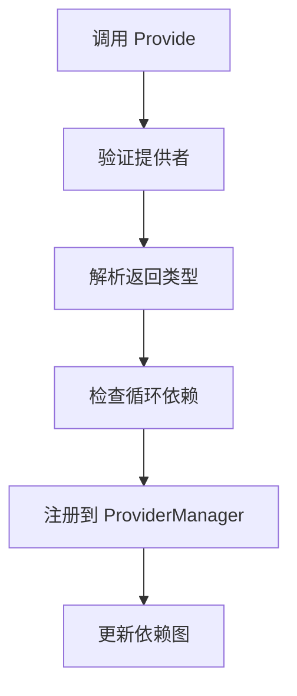
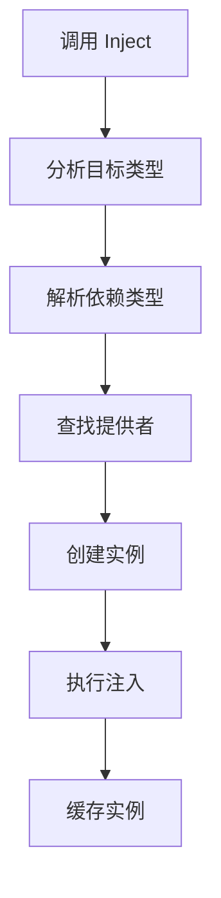
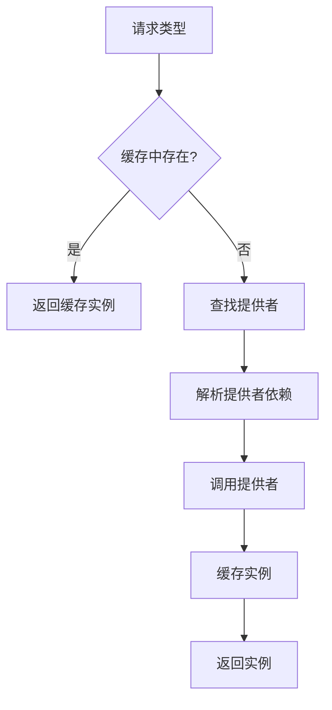

# Dix 架构设计文档

## 🎯 设计目标

Dix 2.0 采用现代化的模块化架构设计，旨在提供：

- **类型安全**：完整的泛型支持，编译时类型检查
- **模块化**：清晰的模块边界，易于维护和扩展
- **高性能**：优化的依赖解析和注入算法
- **开发友好**：直观的 API 设计和丰富的错误信息

## 🏗️ 整体架构

```
dix/
├── dix.go                 # 🚀 公共 API 层
├── dixglobal/            # 🌍 全局容器包
│   └── global.go         # 全局容器实现
└── dixinternal/          # 🔧 核心实现包
    ├── interfaces.go     # 🎯 核心接口定义
    ├── container.go      # 🏗️ 容器实现
    ├── provider.go       # 📦 提供者管理
    ├── resolver.go       # 🔍 依赖解析
    ├── injector.go       # 💉 依赖注入
    ├── cycle_detector.go # 🔄 循环依赖检测
    ├── errors.go         # ❌ 错误处理
    ├── option.go         # ⚙️ 配置选项
    └── api.go           # 🛠️ 便捷函数
```

## 📋 模块职责

### 1. 接口层 (`interfaces.go`)

定义核心接口契约，实现依赖倒置原则：

```go
// Container 容器接口
type Container interface {
    Provide(provider any) error
    Inject(target any, opts ...Option) error
    Graph() *Graph
}

// Provider 提供者接口
type Provider interface {
    Type() reflect.Type
    Call(resolver Resolver) (reflect.Value, error)
}

// Resolver 解析器接口
type Resolver interface {
    Resolve(typ reflect.Type, opts ...Option) (reflect.Value, error)
}
```

**设计原则：**
- 接口隔离：每个接口职责单一
- 依赖倒置：依赖抽象而非具体实现
- 可测试性：便于单元测试和模拟

### 2. 容器实现 (`container.go`)

主容器实现，协调各个模块：

```go
type container struct {
    providers    *ProviderManager
    resolver     Resolver
    injector     Injector
    cycleDetector CycleDetector
    options      *Options
}
```

**核心功能：**
- 容器生命周期管理
- 模块间协调
- 依赖关系图生成
- 配置选项处理

### 3. 提供者管理 (`provider.go`)

管理依赖提供者的注册和查找：

```go
type ProviderManager struct {
    providers map[reflect.Type][]Provider
    mutex     sync.RWMutex
}
```

**核心功能：**
- 提供者注册和验证
- 类型映射管理
- 并发安全访问
- 提供者查找和筛选

### 4. 依赖解析 (`resolver.go`)

核心依赖解析逻辑：

```go
type resolver struct {
    providers     *ProviderManager
    instances     map[reflect.Type]reflect.Value
    cycleDetector CycleDetector
    options       *Options
}
```

**核心功能：**
- 依赖类型解析
- 实例缓存管理
- 循环依赖检测
- 集合类型处理（slice、map）

### 5. 依赖注入 (`injector.go`)

执行实际的依赖注入操作：

```go
type injector struct {
    resolver Resolver
    options  *Options
}
```

**核心功能：**
- 函数参数注入
- 结构体字段注入
- 方法注入（DixInject前缀）
- 错误处理和报告

### 6. 循环检测 (`cycle_detector.go`)

检测和报告循环依赖：

```go
type CycleDetector struct {
    visiting map[reflect.Type]bool
    visited  map[reflect.Type]bool
    path     []reflect.Type
}
```

**核心功能：**
- 深度优先搜索
- 循环路径追踪
- 详细错误报告
- 性能优化

### 7. 错误处理 (`errors.go`)

统一的错误类型和处理：

```go
type Error struct {
    Type    ErrorType
    Message string
    Cause   error
    Context map[string]interface{}
}
```

**错误类型：**
- `ErrProviderInvalid`：无效提供者
- `ErrCircularDependency`：循环依赖
- `ErrTypeNotFound`：类型未找到
- `ErrInjectionFailed`：注入失败

## 🔄 数据流

### 1. 提供者注册流程



### 2. 依赖注入流程



### 3. 依赖解析流程



## 🎨 设计模式

### 1. 依赖注入模式

通过构造函数注入依赖，避免硬编码依赖关系：

```go
// 不好的设计
type Service struct {
    db *sql.DB // 硬编码依赖
}

// 好的设计
func NewService(db Database) *Service {
    return &Service{db: db}
}
```

### 2. 接口隔离模式

定义细粒度接口，避免接口污染：

```go
// 不好的设计
type Container interface {
    Provide(any) error
    Inject(any) error
    Start() error
    Stop() error
    Health() bool
    // ... 太多职责
}

// 好的设计
type Container interface {
    Provide(any) error
    Inject(any) error
    Graph() *Graph
}

type Lifecycle interface {
    Start() error
    Stop() error
}
```

### 3. 策略模式

通过选项模式提供灵活配置：

```go
type Option func(*Options)

func WithValuesNull() Option {
    return func(opts *Options) {
        opts.AllowNullValues = true
    }
}

// 使用
container := dix.New(dix.WithValuesNull())
```

### 4. 观察者模式

通过事件机制支持扩展：

```go
type Event interface {
    Type() string
    Data() interface{}
}

type EventHandler func(Event)

// 未来扩展
container.OnProviderRegistered(handler)
container.OnInstanceCreated(handler)
```

## 🔧 扩展点

### 1. 自定义提供者

实现 `Provider` 接口：

```go
type CustomProvider struct {
    factory func() interface{}
    typ     reflect.Type
}

func (p *CustomProvider) Type() reflect.Type {
    return p.typ
}

func (p *CustomProvider) Call(resolver Resolver) (reflect.Value, error) {
    instance := p.factory()
    return reflect.ValueOf(instance), nil
}
```

### 2. 自定义解析器

实现 `Resolver` 接口：

```go
type CachingResolver struct {
    base  Resolver
    cache map[reflect.Type]reflect.Value
}

func (r *CachingResolver) Resolve(typ reflect.Type, opts ...Option) (reflect.Value, error) {
    if cached, ok := r.cache[typ]; ok {
        return cached, nil
    }
    
    value, err := r.base.Resolve(typ, opts...)
    if err == nil {
        r.cache[typ] = value
    }
    return value, err
}
```

### 3. 中间件支持

通过装饰器模式支持中间件：

```go
type Middleware func(next Injector) Injector

type LoggingMiddleware struct {
    next   Injector
    logger Logger
}

func (m *LoggingMiddleware) Inject(target any, opts ...Option) error {
    m.logger.Info("Injecting", "target", reflect.TypeOf(target))
    err := m.next.Inject(target, opts...)
    if err != nil {
        m.logger.Error("Injection failed", "error", err)
    }
    return err
}
```

## 📈 性能优化

### 1. 类型缓存

```go
var typeCache = sync.Map{}

func getType(v interface{}) reflect.Type {
    if typ, ok := typeCache.Load(v); ok {
        return typ.(reflect.Type)
    }
    
    typ := reflect.TypeOf(v)
    typeCache.Store(v, typ)
    return typ
}
```

### 2. 实例池

```go
type InstancePool struct {
    pools map[reflect.Type]*sync.Pool
}

func (p *InstancePool) Get(typ reflect.Type) interface{} {
    if pool, ok := p.pools[typ]; ok {
        return pool.Get()
    }
    return reflect.New(typ).Interface()
}
```

### 3. 预编译

```go
type CompiledProvider struct {
    factory func(Resolver) (interface{}, error)
    deps    []reflect.Type
}

func (p *CompiledProvider) Call(resolver Resolver) (reflect.Value, error) {
    instance, err := p.factory(resolver)
    return reflect.ValueOf(instance), err
}
```

## 🧪 测试策略

### 1. 单元测试

每个模块独立测试：

```go
func TestProviderManager_Register(t *testing.T) {
    pm := NewProviderManager()
    provider := &mockProvider{}
    
    err := pm.Register(provider)
    assert.NoError(t, err)
    
    providers := pm.GetProviders(provider.Type())
    assert.Len(t, providers, 1)
}
```

### 2. 集成测试

测试模块间协作：

```go
func TestContainer_Integration(t *testing.T) {
    container := New()
    
    container.Provide(func() Database {
        return &mockDB{}
    })
    
    var service Service
    err := container.Inject(&service)
    assert.NoError(t, err)
    assert.NotNil(t, service.DB)
}
```

### 3. 性能测试

```go
func BenchmarkContainer_Inject(b *testing.B) {
    container := setupContainer()
    
    b.ResetTimer()
    for i := 0; i < b.N; i++ {
        var service Service
        container.Inject(&service)
    }
}
```

## 🔮 未来规划

### 1. 并发安全增强

- 读写锁优化
- 无锁数据结构
- 协程池管理

### 2. 生命周期管理

- 单例模式支持
- 作用域管理
- 自动清理

### 3. 配置注入

- 环境变量注入
- 配置文件绑定
- 动态配置更新

### 4. AOP 支持

- 方法拦截
- 切面编程
- 事务管理

### 5. 插件系统

- 插件发现
- 动态加载
- 热更新支持

---

这个架构设计确保了 Dix 框架的可扩展性、可维护性和高性能，为未来的功能扩展奠定了坚实的基础。 